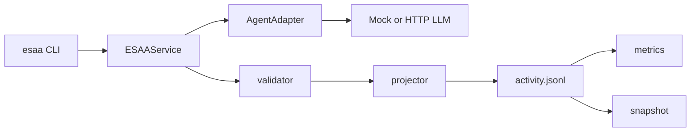

# ESAA Optimizing Onboarding

## Architecture



ESAA keeps the Orchestrator as the single writer. Adapters only return agent result
envelopes. `ESAAService` validates the envelope, appends events under a filesystem
lock, writes orchestrator-approved file updates, projects read models, and verifies
the projection hash.

## Run Modes

Sequential run remains the default:

```powershell
$env:PYTHONPATH='src'
python -m esaa --root . run --steps 1
```

Parallel waves consume `parallel_groups` while preserving serial append:

```powershell
$env:PYTHONPATH='src'
python -m esaa --root . run --steps 1 --parallel 4
```

The service dispatches independent tasks concurrently, then admits the resulting
events one by one. This keeps `activity.jsonl` ordered and append-only.

## Metrics

Structured metrics are available from the event store:

```powershell
$env:PYTHONPATH='src'
python -m esaa --root . metrics
```

The metrics payload includes:

- `events_by_action`
- `output_rejected_by_code`
- `workflow_gate_hits`
- `attempts_by_task`
- `rejection_rate`
- `tasks.done` and `tasks.total`
- optional LLM `latency_ms_total` and token totals when events carry usage metrics

## HTTP LLM Adapter

Use the generic HTTP adapter when an external LLM endpoint can accept the dispatch
context and return an ESAA agent result envelope.

```powershell
$env:PYTHONPATH='src'
$env:ESAA_LLM_URL='http://127.0.0.1:8080/agent'
$env:ESAA_LLM_TOKEN='<optional-token>'
python -m esaa --root . run --adapter http --steps 2
```

Request body is the dispatch context JSON. Response body must be either the agent
result envelope directly or `{ "agent_result": <envelope> }`.

## Hotfix Lifecycle

The runtime now has a CI-covered hotfix path:

```text
issue.report -> hotfix.create -> claim -> complete -> review(approve) -> issue.resolve
```

Hotfix completion requires at least two `verification.checks`, `issue_id`, `fixes`,
and writes constrained by `scope_patch`.

## Snapshots

Create a checkpoint for replay/recovery:

```powershell
$env:PYTHONPATH='src'
python -m esaa --root . snapshot --before 100
```

The snapshot is written to `.roadmap/snapshots/seq-00000100.json` and contains
roadmap, issues, lessons, and projection hashes at that event boundary. Add
`--compact` to write a sidecar archive of included events without mutating the
canonical event store.

## Filesystem Lock

`append_events` creates `.roadmap/activity.jsonl.lock` using atomic create semantics.
If another orchestrator holds the lock, append retries until timeout and then raises
`STORE_LOCK_TIMEOUT`. The lock is removed after successful append or failure.

